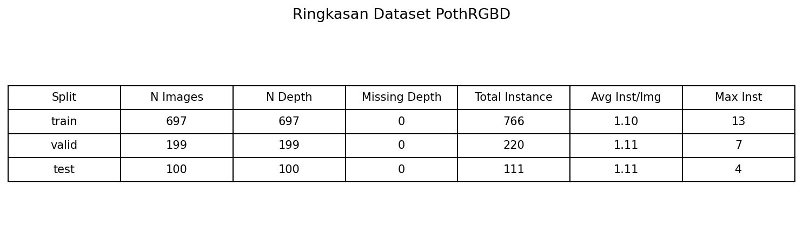
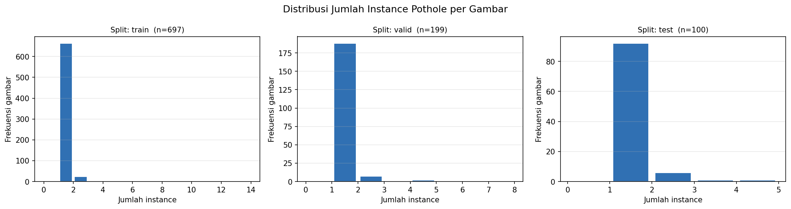
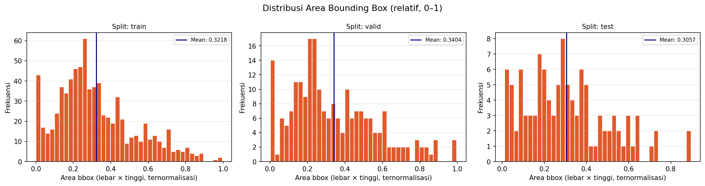
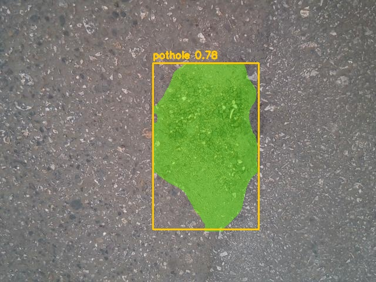
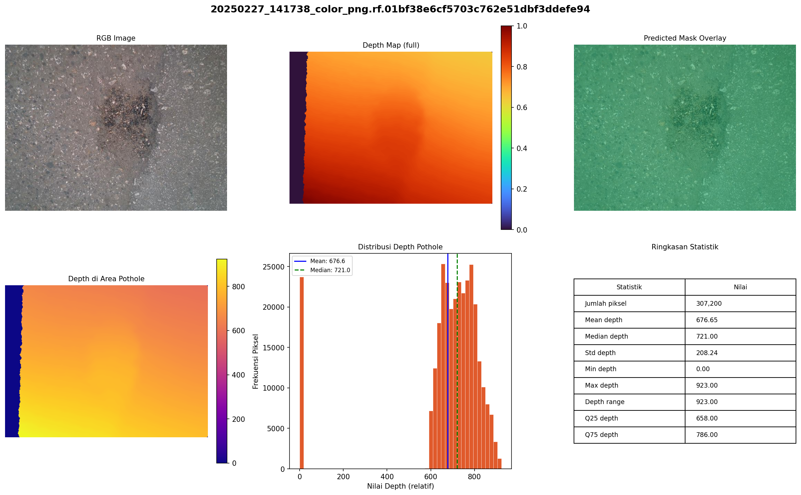
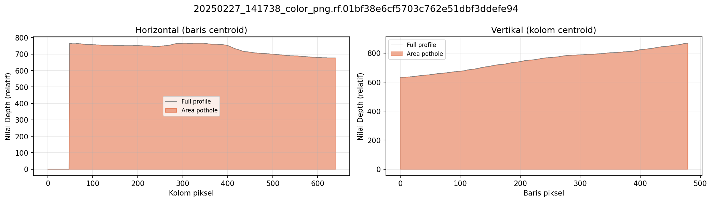
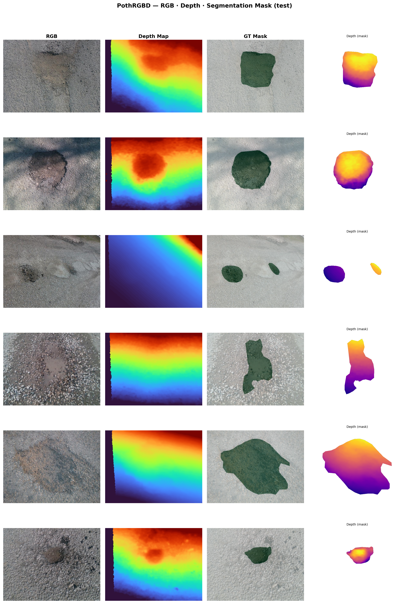
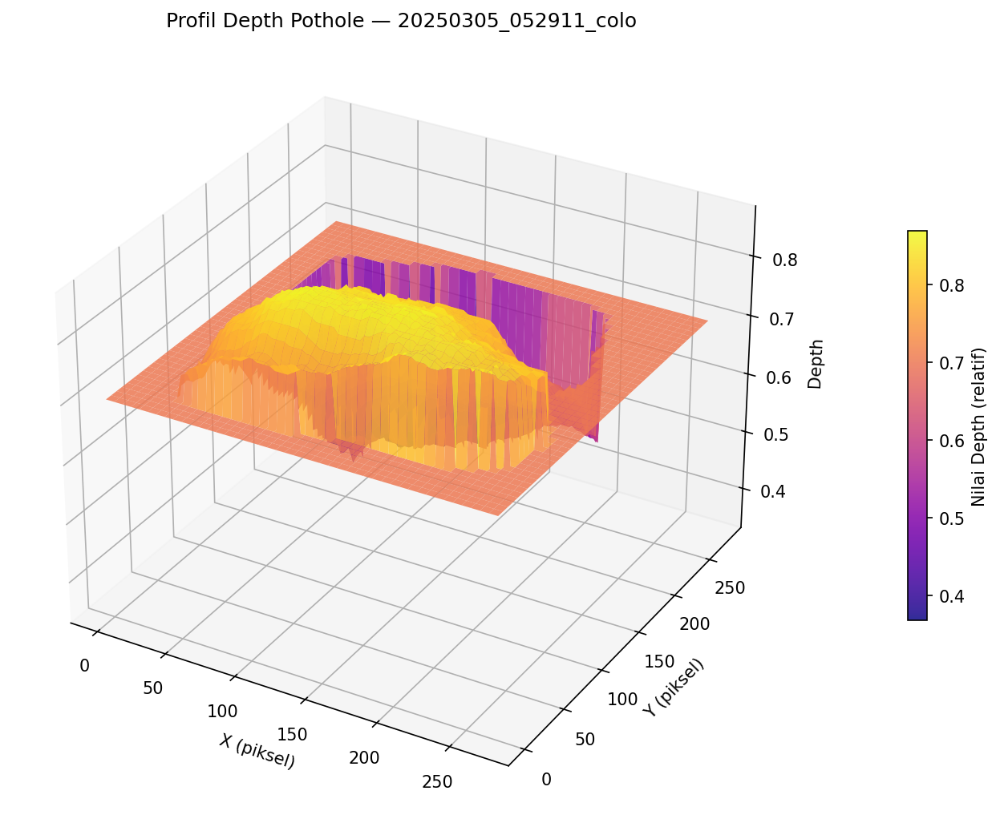

# PothRGBD YOLO Segmentation

Proyek ini merupakan pipeline segmentasi instance lubang jalan menggunakan YOLOv8-seg pada dataset PothRGBD. Proyek ini juga dilengkapi dengan analisis depth map untuk membantu memahami karakteristik visual dan kedalaman relatif area pothole.

## Ringkasan Proyek

Pipeline utama proyek ini adalah sebagai berikut:

```text
Citra RGB -> YOLOv8-seg -> Mask pothole -> Analisis depth -> Visualisasi hasil
```

Fitur utama:

* Persiapan dataset otomatis dari Kaggle
* Pemisahan dataset menjadi train, valid, dan test
* Pemeriksaan integritas pasangan RGB, label, dan depth
* Exploratory Data Analysis
* Training model YOLOv8-seg
* Evaluasi segmentasi berbasis box dan mask
* Inference pada citra test
* Analisis depth pada area pothole
* Visualisasi RGB, depth map, mask, dan depth dalam mask
* Ekspor point cloud 3D dalam format `.ply` secara opsional

## Struktur Folder

```text
pothrgbd-yolo-segmentation/
├── setup_dataset.py
├── requirements.txt
├── README.md
│
├── src/
│   ├── check_dataset.py
│   ├── eda_dataset.py
│   ├── train_segmentation.py
│   ├── evaluate_segmentation.py
│   ├── predict_segmentation.py
│   ├── analyze_depth.py
│   └── visualize_rgb_depth_mask.py
│
├── data/
│   └── pothrgbd/
│       ├── train/
│       │   ├── images/
│       │   ├── labels/
│       │   └── depth/
│       ├── valid/
│       │   ├── images/
│       │   ├── labels/
│       │   └── depth/
│       ├── test/
│       │   ├── images/
│       │   ├── labels/
│       │   └── depth/
│       └── data.yaml
│
├── runs/
│   └── segment/
│
├── outputs/
│   ├── eda/
│   ├── sample_masks/
│   ├── depth_profiles/
│   └── poster_figures/
│
└── docs/
    └── assets/
```

Folder `data/`, `runs/`, dan `outputs/` merupakan hasil proses lokal. Folder tersebut dapat dibuat ulang melalui script yang tersedia.

## Dataset

Dataset yang digunakan adalah **PothRGBD: RGB and Depth Images of Potholes** dari Kaggle.

Karakteristik dataset:

* Berisi citra RGB lubang jalan
* Memiliki pasangan depth map dalam format `.npy`
* Memiliki anotasi segmentasi dalam format YOLO polygon
* Memiliki satu kelas objek, yaitu `pothole`
* Jumlah data sekitar 1.000 pasangan RGB dan depth

Dataset tidak disimpan langsung di repository. Dataset diunduh menggunakan Kaggle API melalui `setup_dataset.py`.

## Instalasi

Clone repository:

```bash
git clone https://github.com/Yuuuuurei/pothrgbd-yolo-segmentation.git
cd pothrgbd-yolo-segmentation
```

Buat environment Python:

```bash
conda create -n pothrgbd python=3.11
conda activate pothrgbd
```

Install dependensi:

```bash
pip install -r requirements.txt
```

Dependensi opsional untuk point cloud 3D:

```bash
pip install open3d
```

## Autentikasi Kaggle

Sebelum dataset dapat diunduh, lakukan autentikasi Kaggle.

Metode yang disarankan:

```bash
pip install kaggle
kaggle auth login
```

Alternatif lain adalah menggunakan file `kaggle.json` dari halaman akun Kaggle. File tersebut dapat diletakkan pada:

```text
~/.kaggle/access_token
```

Pada Windows, biasanya berada di:

```text
C:\Users\<USERNAME>\.kaggle\access_token
```

Jangan mengunggah kredensial Kaggle ke GitHub.

## Setup Dataset

Jalankan:

```bash
python setup_dataset.py
```

Script ini akan:

1. Mengecek kredensial Kaggle
2. Mengunduh dataset dari Kaggle
3. Mengekstrak dataset mentah
4. Memasangkan citra RGB, label YOLO, dan depth map
5. Membagi dataset menjadi train, valid, dan test
6. Membuat file `data/pothrgbd/data.yaml`

Untuk membuat ulang dataset dari awal:

```bash
python setup_dataset.py --force
```

Untuk mengganti slug dataset Kaggle:

```bash
python setup_dataset.py --slug mahyeks/pothrgbd-rgb-and-depth-images-of-potholes
```

## Pemeriksaan Dataset

Setelah setup dataset, jalankan pemeriksaan integritas:

```bash
python src/check_dataset.py
```

Pemeriksaan ini memastikan bahwa setiap citra RGB memiliki:

* File label YOLO yang sesuai
* File depth `.npy` yang sesuai
* Format label segmentasi yang valid

## Exploratory Data Analysis

Jalankan EDA:

```bash
python src/eda_dataset.py
```

Contoh menjalankan EDA untuk split tertentu:

```bash
python src/eda_dataset.py --split train --max 500
```

Output EDA disimpan pada:

```text
outputs/eda/
```

Visualisasi EDA mencakup:

* Ringkasan jumlah data per split
* Distribusi jumlah instance pothole per gambar
* Distribusi area bounding box relatif
* Statistik dataset

### Ringkasan Dataset



### Distribusi Jumlah Instance per Gambar



### Distribusi Area Bounding Box



## Training Model

Training default menggunakan YOLOv8n-seg:

```bash
python src/train_segmentation.py
```

Training dengan model lebih besar:

```bash
python src/train_segmentation.py --model yolov8s-seg.pt --epochs 100
```

Melanjutkan training dari checkpoint:

```bash
python src/train_segmentation.py --resume runs/segment/pothrgbd_seg/weights/last.pt
```

Output training disimpan pada:

```text
runs/segment/
```

Checkpoint terbaik biasanya tersimpan pada:

```text
runs/segment/pothrgbd_seg/weights/best.pt
```

## Evaluasi Model

Evaluasi model dilakukan pada split test menggunakan checkpoint terbaik.

Konfigurasi evaluasi:

```text
Split   : test
Weights : runs/segment/pothrgbd_seg/weights/best.pt
```

Hasil evaluasi:

| Jenis Metrik | Precision | Recall |  mAP50 | mAP50-95 |
| ------------ | --------: | -----: | -----: | -------: |
| Box          |    0.9243 | 0.8797 | 0.9456 |   0.6030 |
| Mask         |    0.9526 | 0.9060 | 0.9720 |   0.6396 |

Interpretasi singkat:

* Nilai **Mask mAP50 = 0.9720** menunjukkan performa segmentasi yang sangat baik pada ambang IoU 0.50.
* Nilai **Mask mAP50-95 = 0.6396** lebih rendah karena metrik ini mengevaluasi segmentasi pada rentang ambang IoU yang lebih ketat.
* Precision mask lebih tinggi daripada recall, sehingga model cenderung cukup akurat saat memprediksi area pothole, tetapi masih dapat melewatkan sebagian area atau instance tertentu.

## Inference

Jalankan inference pada folder test:

```bash
python src/predict_segmentation.py
```

Inference pada source tertentu:

```bash
python src/predict_segmentation.py --source data/pothrgbd/test/images --conf 0.40
```

Inference dengan checkpoint tertentu:

```bash
python src/predict_segmentation.py --weights runs/segment/pothrgbd_seg/weights/best.pt
```

Output prediksi disimpan pada:

```text
runs/predict/
outputs/sample_masks/
```

### Contoh Hasil Segmentasi



## Analisis Depth

Depth map pada dataset ini disimpan sebagai file `.npy`. Nilai depth diperlakukan sebagai **nilai relatif**, bukan satuan fisik absolut seperti sentimeter atau meter. Hal ini karena metadata kalibrasi kamera tidak selalu tersedia.

Jalankan analisis depth pada satu pasangan RGB-depth:

```bash
python src/analyze_depth.py --rgb "data/pothrgbd/test/images/example.jpg" --depth "data/pothrgbd/test/depth/example.npy"
```

Jika tidak ingin membuat point cloud:

```bash
python src/analyze_depth.py --rgb "data/pothrgbd/test/images/example.jpg" --depth "data/pothrgbd/test/depth/example.npy" --no-pcd
```

Output analisis depth disimpan pada:

```text
outputs/depth_profiles/
```

Statistik yang dihitung:

* Mean depth
* Median depth
* Standard deviation
* Minimum depth
* Maximum depth
* Depth range
* Persentil Q25 dan Q75

### Visualisasi Analisis Depth



### Profil Depth



## Visualisasi RGB, Depth, dan Mask

Script visualisasi menghasilkan grid yang memperlihatkan hubungan antara citra RGB, depth map, ground-truth mask, dan depth dalam area mask.

Jalankan:

```bash
python src/visualize_rgb_depth_mask.py --split test --n 6
```

Output disimpan pada:

```text
outputs/poster_figures/
```

### Grid RGB, Depth, dan Mask



### Surface Plot Depth



## Rekomendasi Alur Pengerjaan

```bash
# 1. Install dependensi
pip install -r requirements.txt

# 2. Login Kaggle
kaggle auth login

# 3. Download dan setup dataset
python setup_dataset.py

# 4. Periksa dataset
python src/check_dataset.py

# 5. Jalankan EDA
python src/eda_dataset.py

# 6. Training model
python src/train_segmentation.py

# 7. Evaluasi model
python src/evaluate_segmentation.py

# 8. Inference
python src/predict_segmentation.py

# 9. Analisis depth
python src/analyze_depth.py --rgb "path/to/image.jpg" --depth "path/to/depth.npy" --no-pcd

# 10. Buat visualisasi poster
python src/visualize_rgb_depth_mask.py --split test --n 6
```

## Catatan Implementasi

* YOLOv8-seg menggunakan citra RGB sebagai input utama.
* Depth map digunakan untuk analisis lanjutan setelah segmentasi, bukan sebagai input langsung model YOLO.
* Label dataset menggunakan format YOLO segmentation polygon.
* File depth menggunakan format `.npy` bertipe `uint16`.
* Visualisasi depth perlu normalisasi agar tidak tampak terlalu gelap.
* Open3D bersifat opsional. Jika rendering headless gagal pada Windows, file `.ply` tetap dapat dibuka dengan MeshLab, CloudCompare, Blender, atau Open3D visualizer.

## Dependensi Utama

| Library       | Fungsi                                   |
| ------------- | ---------------------------------------- |
| ultralytics   | Training, evaluasi, dan inference YOLOv8 |
| opencv-python | Pemrosesan citra                         |
| numpy         | Operasi array dan depth map              |
| matplotlib    | Visualisasi grafik dan poster            |
| kaggle        | Download dataset                         |
| open3d        | Point cloud 3D opsional                  |
| tqdm          | Progress bar                             |

## Lisensi

Repository ini dibuat untuk keperluan akademik dan eksperimen segmentasi pothole berbasis RGB-depth. Periksa halaman dataset Kaggle untuk ketentuan lisensi dataset yang digunakan.
